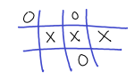

# Assignment 1 (Due Monday, July 27 at 5:30pm)   
---

This assignment is to ensure that you get practice with basic Java. For full marks in the assignment, you will need to successfully use arrays, String objects, Scanner objects, control flow constructs (branching and looping) and implement static functions. In this assignment, your code will follow the procedural programming paradigm (not object oriented). 


## Tic-Tac-Toe++



You will implement a variation of the game [tic-tac-toe](https://en.wikipedia.org/wiki/Tic-tac-toe). Our version of the game will allow for different sizes of the board and a different winning condition. The game you are (or might be) familiar with is played on a 3x3 grid. Our _normal_ game is played on a 10x10 grid and the winning condition is that a player (either X or O) has ten of their symbol in a row (either vertically, horizontally or diagonally). In general, a game can be played any NxM grid and the winning condition will be when K of the same symbols are in a row (again, either vertically, horizontally or diagonally). Here, N, M and K will be specified by an initialization file that your game will read when it starts. We will use N-M-K to denote the parameters of a given game. For example, a regular real life game of tic-tac-toe is a 3-3-3 game, our default game is a 10-10-10 game, and a 12-5-4 game has a grid with 12 rows, 5 columns and the winning condition is 4 of the same symbols in a row. 


Start by cloning this repository. It has start-up code (skeleton files) for the assignment that you will modify, commit and then push back to you github repository. The start-up consists of a single Java class (called `TicTacToeGame.java`), an initialization file for the game (called `init`) and single plain text file (called `submit-01`).  You will modify the TicTacToeGame.java and submit.1 files, `commit` your changes, and then `push` them back in order to _submit_ your assignment.

If there is a method declared in the starter `TicTacToeGame.java` file, you _must_ complete it. In particular, for this assignment, you must complete the `win` method. Do __not__ change its modifiers, return type, argument list or name though. As part of testing, we will call your `win` method from a testing program with various inputs without running your game. If _anything_ other than the body of the method is modified by you, we will not be able to test it and you will receive zero marks for this part.  We will, of course, also run your game to test the actual game play. 

A rubric (`rubric-01.md`) is included. Be sure to read this file, but do _not_ modify it. When your assignment is graded, a TA will edit your rubric file and push it back to your repository.


Here is the full specification for this assignment.

### submit-01 [10 marks]

Your `submit-01` will consist of __four__ lines: your student ID number, your cmail username, your name and your GitHub username (in that order). Give your full cunet email address (without the dots in your name). For example, a sample file might look like 

```text
200976283
catkittensish@cmail.carleton.ca
Cat Kittenish
supercoderkitty
```

Note: The file must is a plain text file. Do _not_ change the format of the file anything else (such as rich text, or .docx, etc). Do _not_ add an extension to the file.  Be sure to check that your operating system (in particular if you are using Windows) does not have a hidden `.txt` extension for this file.

### init [0 marks]

The initialization file consists of three lines that specify N, M and K, respectively for the game. N is the number of rows in the grid, M is the number of columns and K is the number of symbols needed in a row to trigger a win. You do not have to submit (`commit` and `push`) this file. However, you _should_ be using this file to test that your code works on a game that is not standard if you want full marks for the assignment. The default game is a regular game of tic-tac-toe with all parameters equal to 10. We will test your code with the default values and various different configurations (N,M,K values). See the rubric for more details.


### TicTacToeGame.java [90 marks]

The game is a two player text-based game between either two human players or between one human player and the computer. Players take turns entering a position in the grid that they would like to play their symbol. The game is _won_ when a players plays a symbol and that move completes a row/column/diagaonal of at least K of that symbol. If the entire grid is filled with symbols and there is no winner then the game is a _draw_. 

Valid input for a position to play is a line of text of the form `RR r CC c` or `CC c RR r`, where RR is any case variant of the string "ROW" or "R", r is a number (using digits, not in words), CC is any case variant of the string "COLUMN", "COL" or "C", and c is a number. For example, each of the following are valid inputs

```
row 3 column 4
Row 2 COL 0
col 1 rOw 4
c 0 R 0
```

while 

```
row two column one
ro 2 co 4
r 2 r 1
``` 

are invalid.  Note that the _first_ row or column is indicated with 0 and NOT 1.
 
The game uses command line arguments to specify if it will be a human-human or human-computer game.  


Here is a list of the specifications for your submission. Read the entire list and decide which items should be considered first. Don't try and finish the entire assignment in one sitting. Programming is an _incremental_ process. Do one thing at a time (starting early) and you will that progress is being made.

1. You must use the `Scanner` class for user input (from the keyboard). 
2. You must use a 2-dimensional array of type `Character` to represent the game grid.  
3. You can use `String` and `StringBuilder` objects as you need.
4. You should not use any other classes in your code. There will be some other classes for reading the init file, but you won't be coding with these yourself in this assignment. You can use always the `Math` class if you wish.
5. Your `main` method will drive your game by calling other static methods in your class. 	The overall control flow of your game will be in `main` but the details of the different actions will be in other static methods.
6. Particular tasks should have their own method. (This is procedural programming!)
7. If zero command line arguments are given then your game will be between one human player and the computer. The human player will play first and they will play X. The computer will initially be O and play second.
8. If one command line argument is given and it is the string `2p`, then the game will be between two human players. Player 1 will start with X (and player 2 will be O). 
Do not ask the players for their names. They are simply player 1 and player 2.
9. A game ends when either a player wins or all positions are played and there is no winner (a draw). You do not need to recognize a draw until the entire grid is filled. (A better version of the game would determine if at any point in the game is must end in a draw. You are not responsible for this.)
10. When a game ends, a user friendly message will say which player won the game (player 1 or player 2 or computer) and how many symbols in a row they won with. This number might be greater than K (if K is smaller then N and/or M).
11. Your program will let a player (or players) play as many games as they wish. After the user friendly message is displayed when a game ends the user (or users) is asked if they would like to player another game or end. The answer to this question (text input) will be `yes` or `no` (in lower case only).
12. When a new game is started, the player that previously started the game will now play second and the player that previously stated second will start the game. The starting player will always play the symbol `X`, but their _name_ (denoted player 1 or player 2 or computer) will remain fixed. In each subsequent game, the player that starts will change (alternate). 
13. The game grid will be displayed (showing all X's, O's and blanks) after each move is played (by either a human player or the computer). When the computer plays a move, a line of text stating its move should be be displayed before the grid is shown.
14. Your game must be user friendly.  That is, it must provide useful prompts to the user during the game. 
15. You can assume that all input text is _valid_. That is, we will only test your code with input that follows this specification.
16. If a user enters a position to play that is not allowed, because there is already a symbol in that position or the position does not exist in the grid, a useful message is displayed to the screen and they are asked to enter another position. This repeats until a position is played that is currently empty in the grid.  An example of a position that does not exists is trying to play in position `r 12 c 4` in 10-10-10 game. 
17. When the user(s) decide to stop playing, after completing a game, some statistics will be displayed. You will output the total number of games played, the total number of wins by each player, the total number of draws, and the largest winning row/column/diagonal of any game played. For example, the output might look like

```text
Thanks for playing
Total games     : 7
Player 1 wins   : 2
Computer wins   : 3
Number of draws : 2
Best win        : 6 in a row
```
18. There will be _no_ other input asked for or expected from the user during the game. 
19. Your game must play a valid game of tic-tac-toe++.
20. Remember to `push` your changes back to your master repository on GitHib (so that your assignment can be graded).

##### Example
A run of a human versus computer 2-4-3 game might look like the following

```
C:\user> java TicTacToeGame 
Welcome to tic-tac-toe++
player 1 input : r 0 c 0

 X |   |   | 
---+---+---+---
   |   |   |

computer plays r 1 c 1

 X |   |   | 
---+---+---+---
   | O |   |
	
player 1 input : c 4 row 0
That move is not allowed. Try again.
player 1 input : c 1 row 0

 X | X |   | 
---+---+---+---
   | O |   |

computer plays r 0 C 3

 X | X |   | O
---+---+---+---
   | O |   |

	
player 1 input : c 2 roW 0

 X | X | X | O
---+---+---+---
   | O |   |

Player 1 wins with 3 symbols!

Would you like to play again? no

Thanks for playing tic-tac-toe++
total games   : 1
player 1 wins : 1
computer wins : 0
draws         : 0
best win      : 3 symbols
```


